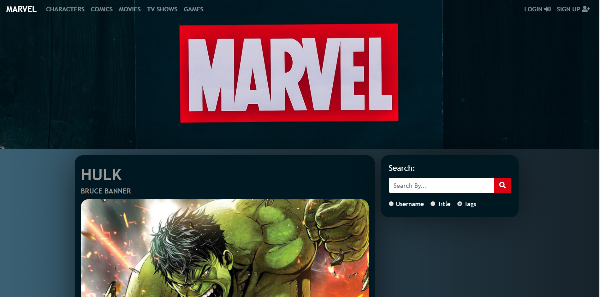

# CMS project
I finished Edwin's Diaz PHP udemy course and as a way of practice and putting what I learnt into action I built a CMS inspired by Marvel. 

### Screenshots

Login Page:

Home page: 

Admin, All posts:

Comments About A Post (as a guest):

User’s Public Profile Page:

### To run this app:
- Clone or download the repository
- Make sure the root directory name is 'marvel'
- Admin name is x-men93 and password is 123456
